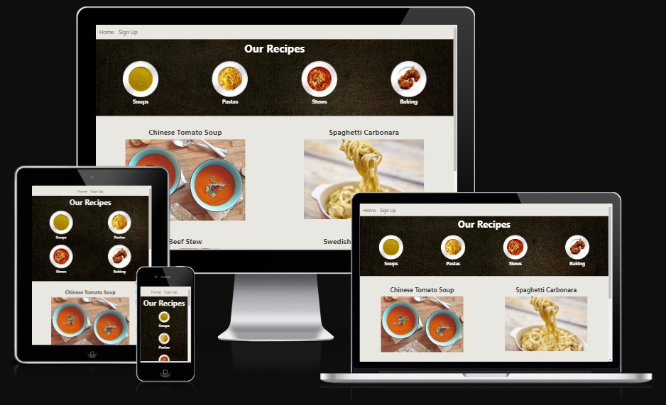
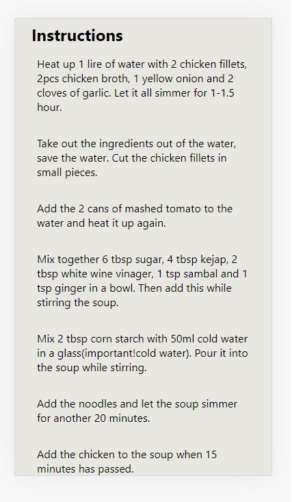
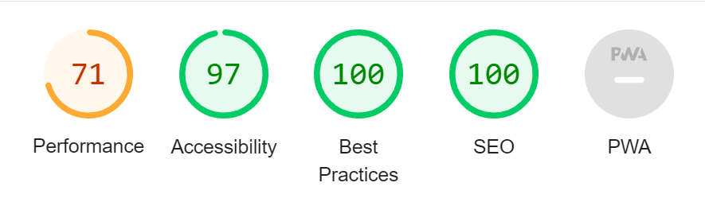

## Mobile Easy Recipes
----------------------------
Using our mobile phones for finding and following recipes while cooking, is replacing recipe books. With this, there comes new issues however. Too many recipe websites are not mobile friendly, and often we find ourself scrolling up and down countless times between the ingredients section and instructions section. I said that one day I would make a mobile friendly webpage designed to be helpful in the kitchen. So here we are. Let me walk you through my design and potential features!

## Features

----------------------------

* Navigation bar
    * Featured on top of all of the pages for easy navigation.
    * Users can quickly navigate to the different categories of food by clicking on each plate.
    * Clicking on a plate will send user to the matching recipe category.
    * Users can also scroll down directlty on the home page to see all recipes. 
    * Sign up section will allow the user to sign up and recive notification about new recipes added. 

* The Landing Page Image
    * The landing page image creates an interactive, fun and easily navigated menu. 
    * It provides clear navigation for the user while remaining its design on all media screen sizes.
    * User can then scroll down to find a list of all recipes provided. 

* The food plates 
    * Each food plate will direct user to a recipe matching the category. 
    * As following, Soups plate sends user to the Chinese Tomato Soup recipe, Pastas send user to Spaghetti Carbonara, Stews to Beef Stew and baking to Swedish Chocolate Balls.

* The Footer
    * The footer section shows the user each social media platform they can find this page on. Colors are matching those of the official logos for easy navigation. 

* Recipe Layout 
    * Each recipe layout may look simple for desktop users, but the weight of this site lays on mobile viewing. As people use their phone for following recipes, this is what I have focused on. What makes this website different from most, is that in the Instructions section - the ammount of ingredients is listed aswell. This saves a lot of time while following recipes on mobile phones, as users do not have to scroll up and down between the ammounts of ingredients, and instructions. 

* Sign Up 
    * As stated earlier, the Sign Up navigation takes user to a new page. Here, they will have the option to fill in their name information together with email, to recive news of when new recipes have been added to the webpage. 

## Testing
-------------------------
* I tested that this page works on following browsers: Chrome, Firefox
* I have tested that the site is responsive, looks good on all device sizes using the devtools device toolbar. 
* I have tested that the navigation and all links works, are readable and easy to understand. If hero image on landing page fails to load, user can still see the plates and text.
* I have confirmed that the form works, that it requires entries in all fields to work, and will only accept email in the email field. The submit button works. 

* Bugs
    * Solved
        * When first deploying project to GitHub, my site was not loading css files or links. Sollution was to remove the ="/ from all links in all files and on all href and src links. This was quickly solved with help of the good people of Stack Overflow. 

Validator testing
   * CSS
        * No Errors were returned when passing through the offical (Jigsaw) validator
* HTML 
    * Error found

* Accessibillity 
    * I have tested that the colors and fonts chosen are easy to read and accessible, tested in lighthouse inside devtools and using an icognito tab. 

* Unfixed bugs
    * No unfixed bugs

## Deployment
-------------------------

* The site was deployed to GitHub pages by: 
    * Navigating to the pages section.
    * Choosing Main Branch from source section. 
    * Once selected and saved, the branch was launched and after a short time and refresh of page, provided a message and a clickable button 'Visit page'.

Link to live website is found here - https://camilcar.github.io/mobile-easy-recipes/index.html 

## Credits
-------------------------
* The code for all social media links was taken from the CI Love Running Project. 
* The code for signup form was based on the code from the CI Love Running Project. 

Media 
* All images used on site was taken from https://pexels.com 
* Used photoshop to edit hero image on main page

